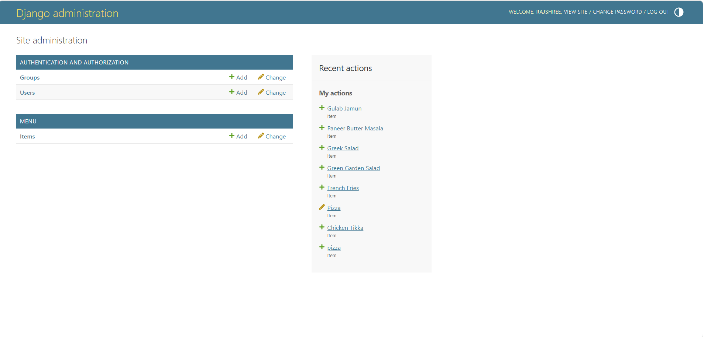
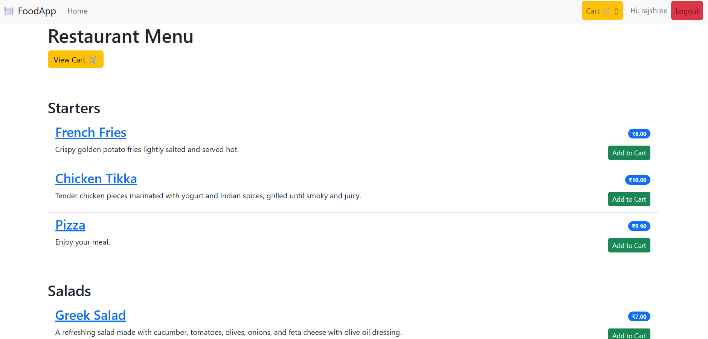
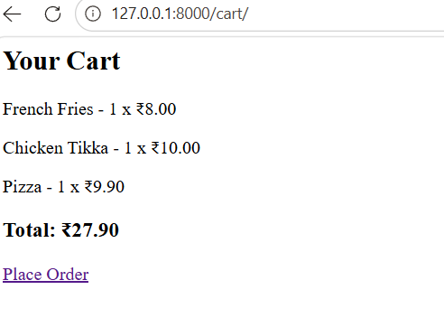
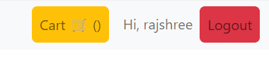
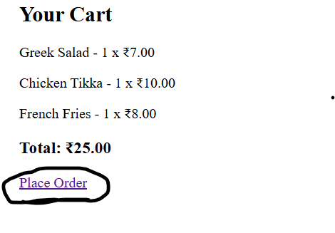

🍽️ YOUR PROJECT: Food Ordering Web Application

👉 It is a Django-based full-stack web app where:

Users can browse food items 🍕

Add items to cart 🛒

Place orders 📦

Admin can manage food items

🧠 1. OVERALL FLOW (VERY IMPORTANT)

👉 This is how your app works:

User opens homepage

Menu items are displayed (grouped by category)

User clicks Add to Cart 🛒

Item is stored in Cart table (database)

User goes to Cart page

Clicks Place Order 📦

Order is saved → Cart is cleared

🏗️ 2. PROJECT STRUCTURE
mysite/
│
├── mysite/        → Main project settings
├── menu/          → Your app (core logic)
│
├── templates/     → HTML files
├── db.sqlite3     → Database
📦 3. MODELS (DATABASE DESIGN)

👉 Located in models.py

🥗 1. Item Model (Food Items)
class Item(models.Model):

👉 Stores:

meal → name of food

description

price

meal_type → category (starter, dessert)

status → available/unavailable

📌 Example:

Pizza → ₹200 → Available
🛒 2. Cart Model
class Cart(models.Model):

👉 Stores:

user

item

quantity

📌 Example:

User: Rajshree
Item: Burger
Quantity: 2
📦 3. Order Model
class Order(models.Model):

👉 Stores:

user

items (many items)

total price

date

📌 Example:

Order → Pizza + Coke → ₹300
⚙️ 4. VIEWS (LOGIC OF APP)

👉 Located in views.py

🏠 MenuList (Homepage)
class MenuList(generic.ListView)

👉 Shows:

All food items

Grouped by meal type

🔍 MenuItemDetail

👉 Shows single item details

🛒 add_to_cart()
def add_to_cart(request, pk):

👉 Logic:

Get item

Check if already in cart

If yes → increase quantity

If no → create new

🛒 cart_view()

👉 Shows:

All cart items

Total price

❌ remove_from_cart()

👉 Removes item from cart

📦 place_order()

👉 Logic:

Take all cart items

Calculate total

Create order

Clear cart

🌐 5. URLS (ROUTING)

👉 menu/urls.py

URL	Purpose
/	Home
/item/1/	Item detail
/add-to-cart/1/	Add item
/cart/	View cart
/place-order/	Place order
🎨 6. TEMPLATES (FRONTEND)
🏠 index.html

👉 Shows:

Menu items

Add to cart button

📄 menu_item_detail.html

👉 Shows:

Item details

Add to cart

🛒 cart.html

👉 Shows:

Cart items

Total price

Place order button

🧱 base.html

👉 Common layout:

Navbar

Cart button

Login/logout

🔐 7. AUTHENTICATION

👉 Using Django built-in auth

Login

Logout

@login_required → protects cart & order

💾 8. DATABASE (SQLite)

👉 Stores:

Users

Items

Cart

Orders

## 📸 Screenshots

### Admin

### 🍽️ Menu Items

### 🛒 Cart Page

### 🔐 Login Page

### 📦 Order Placement

💯 9. KEY CONCEPTS YOU USED

✔ Django Models
✔ Class-Based Views
✔ Function-Based Views
✔ Authentication
✔ ORM (database queries)
✔ Templates & Jinja syntax
✔ URL routing
✔ CRUD operations

## 👩‍💻 Author

**Rajshree Nandkumar Gholase**  
B.Tech AI & Data Science  

---

## ⭐ Show Your Support

If you like this project, please give it a ⭐ on GitHub!

## 📬 Contact

Feel free to connect with me for collaboration or opportunities.

Gmail: gholaserajshree@gmail.com
